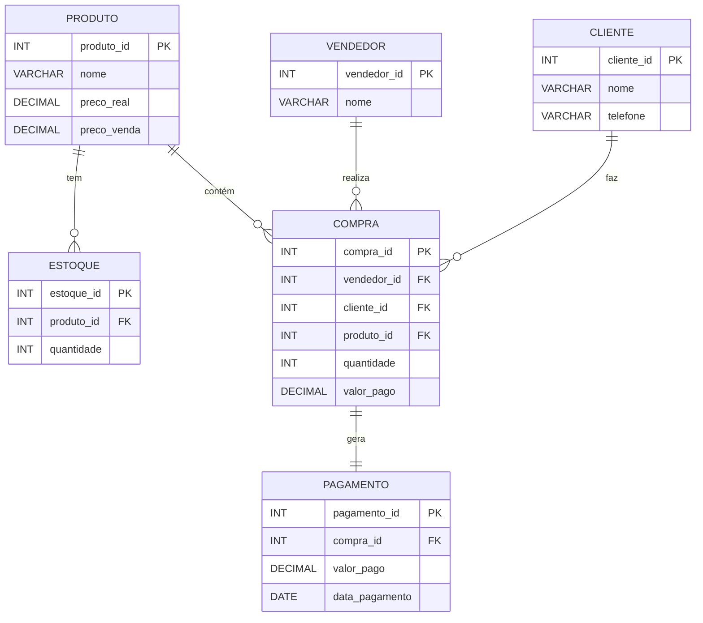

## **Modelo de Banco de Dados Detalhado**

Este documento descreve o modelo de banco de dados de um sistema de gerenciamento de vendas, com foco nas entidades, relacionamentos, atributos e regras de negócio. O objetivo é fornecer uma visão clara e detalhada de como os dados são estruturados e inter-relacionados.

---
### **Relacionamentos entre Entidades**

1. **Produto → Estoque**  
   - **Relação**: Um produto pode ter **um registro de estoque** (relação 1:1).  
   - **Explicação**: Cada produto cadastrado no sistema possui um único registro de estoque, que controla a quantidade disponível. Isso garante que o estoque seja gerenciado de forma precisa e centralizada.  
   - **Exclusão em Cascata**: Quando um produto é excluído, seu registro de estoque também é excluído automaticamente, evitando dados órfãos no banco de dados.

2. **Produto → Compra**  
   - **Relação**: Um produto pode estar em **várias compras** (relação 1:N).  
   - **Explicação**: Um mesmo produto pode ser vendido em diferentes compras, registrando quantidades e valores pagos em cada transação. Isso permite rastrear o histórico de vendas de cada produto.  
   - **Exclusão em Cascata**: Quando um produto é excluído, todas as compras relacionadas a ele também são excluídas, mantendo a integridade do banco de dados.

3. **Vendedor → Compra**  
   - **Relação**: Um vendedor pode realizar **várias compras** (relação 1:N).  
   - **Explicação**: Cada vendedor pode estar associado a múltiplas transações de compra, representando suas vendas. Isso permite avaliar o desempenho individual de cada vendedor.  
   - **Exclusão em Cascata**: Quando um vendedor é excluído, todas as compras realizadas por ele também são excluídas, garantindo que não haja registros inconsistentes.

4. **Cliente → Compra**  
   - **Relação**: Um cliente pode fazer **várias compras** (relação 1:N).  
   - **Explicação**: Um cliente pode realizar múltiplas compras ao longo do tempo, registrando seu histórico de transações. Isso facilita a análise do comportamento de compra dos clientes.  
   - **Exclusão em Cascata**: Quando um cliente é excluído, todas as compras realizadas por ele também são excluídas, mantendo a consistência do banco de dados.

5. **Compra → Pagamento**  
   - **Relação**: Uma compra gera **exatamente um pagamento** (relação 1:1).  
   - **Explicação**: Cada compra realizada deve estar associada a um único pagamento, que registra o valor pago e a data da transação. Isso garante que todas as transações sejam devidamente registradas e rastreadas.  
   - **Exclusão em Cascata**: Quando uma compra é excluída, o pagamento associado a ela também é excluído, evitando inconsistências.

---

## **Diagrama ER (Entidade-Relacionamento)**

O diagrama ER abaixo ilustra as entidades e seus relacionamentos:



---

### **Legenda dos Símbolos**

- **`||--||`**: Relacionamento obrigatório (1 para 1).  
  - Exemplo: Uma `COMPRA` gera exatamente um `PAGAMENTO`.

- **`||--o{`**: Relacionamento onde uma entidade pode estar associada a **zero ou mais** instâncias de outra entidade.  
  - Exemplo: Um `PRODUTO` pode estar em zero ou mais `COMPRAS`.

- **`PK`**: Chave primária (Primary Key). Identifica unicamente uma entidade.  
  - Exemplo: `produto_id` é a chave primária da entidade `PRODUTO`.

- **`FK`**: Chave estrangeira (Foreign Key). Representa um relacionamento com outra entidade.  
  - Exemplo: `compra_id` na entidade `PAGAMENTO` é uma chave estrangeira que se relaciona com `COMPRA`.

- **`{}`**: Representa os atributos de uma entidade.  
  - Exemplo: Dentro de `PRODUTO`, os atributos são `produto_id`, `nome`, `preco_real`, etc.

- **`:`**: Usado para descrever o tipo de relacionamento entre entidades.  
  - Exemplo: `PRODUTO ||--o{ COMPRA : "contém"` significa que um produto pode estar contido em várias compras.

---

### **Explicação das Entidades**

1. **PRODUTO**:
   - Representa os itens disponíveis para venda.
   - Atributos:
     - `produto_id` (**chave primária**): Identificador único do produto.
     - `nome`: Nome do produto.
     - `preco_real`: Preço de custo do produto.
     - `preco_venda`: Preço de venda do produto.
   - Relacionamentos:
     - Um produto pode ter um registro de estoque (`PRODUTO ||--o{ ESTOQUE`).
     - Um produto pode estar contido em várias compras (`PRODUTO ||--o{ COMPRA`).

2. **VENDEDOR**:
   - Representa os vendedores responsáveis pelas vendas.
   - Atributos:
     - `vendedor_id` (**chave primária**): Identificador único do vendedor.
     - `nome`: Nome do vendedor.
   - Relacionamentos:
     - Um vendedor pode realizar várias compras (`VENDEDOR ||--o{ COMPRA`).

3. **CLIENTE**:
   - Representa os clientes que realizam as compras.
   - Atributos:
     - `cliente_id` (**chave primária**): Identificador único do cliente.
     - `nome`: Nome do cliente.
     - `telefone`: Número de telefone do cliente.
   - Relacionamentos:
     - Um cliente pode fazer várias compras (`CLIENTE ||--o{ COMPRA`).

4. **COMPRA**:
   - Representa as transações de compra realizadas.
   - Atributos:
     - `compra_id` (**chave primária**): Identificador único da compra.
     - `vendedor_id` (*chave estrangeira*): Identificador do vendedor responsável pela compra.
     - `cliente_id` (*chave estrangeira*): Identificador do cliente que realizou a compra.
     - `produto_id` (*chave estrangeira*): Identificador do produto comprado.
     - `quantidade`: Quantidade do produto comprado.
     - `valor_pago`: Valor total pago na compra.
   - Relacionamentos:
     - Uma compra gera exatamente um pagamento (`COMPRA ||--|| PAGAMENTO`).

5. **ESTOQUE**:
   - Controla a quantidade disponível de cada produto.
   - Atributos:
     - `estoque_id` (**chave primária**): Identificador único do registro de estoque.
     - `produto_id` (*chave estrangeira*): Identificador do produto relacionado.
     - `quantidade`: Quantidade disponível em estoque.
   - Relacionamentos:
     - Um produto pode ter um registro de estoque (`PRODUTO ||--o{ ESTOQUE`).

6. **PAGAMENTO**:
   - Registra os pagamentos associados às compras.
   - Atributos:
     - `pagamento_id` (**chave primária**): Identificador único do pagamento.
     - `compra_id` (*chave estrangeira*): Identificador da compra relacionada.
     - `valor_pago`: Valor pago na transação.
     - `data_pagamento`: Data em que o pagamento foi realizado.
   - Relacionamentos:
     - Um pagamento está diretamente associado a uma compra (`COMPRA ||--|| PAGAMENTO`).

---

### **Criação das Tabelas no MySQL**

Abaixo está o código SQL para criar as tabelas no MySQL, seguindo o modelo descrito:

```mysql
-- Criando o Banco de Dados
CREATE DATABASE loja;

-- Tabela PRODUTO
CREATE TABLE PRODUTO (
    produto_id INT AUTO_INCREMENT PRIMARY KEY,
    nome VARCHAR(255) NOT NULL,
    preco_real DECIMAL(10, 2) NOT NULL,
    preco_venda DECIMAL(10, 2) NOT NULL
);

-- Tabela VENDEDOR
CREATE TABLE VENDEDOR (
    vendedor_id INT AUTO_INCREMENT PRIMARY KEY,
    nome VARCHAR(255) NOT NULL
);

-- Tabela CLIENTE
CREATE TABLE CLIENTE (
    cliente_id INT AUTO_INCREMENT PRIMARY KEY,
    nome VARCHAR(255) NOT NULL,
    telefone VARCHAR(15)
);

-- Tabela COMPRA
CREATE TABLE COMPRA (
    compra_id INT AUTO_INCREMENT PRIMARY KEY,
    vendedor_id INT,
    cliente_id INT,
    produto_id INT,
    quantidade INT NOT NULL,
    valor_pago DECIMAL(10, 2) NOT NULL,
    FOREIGN KEY (vendedor_id) REFERENCES VENDEDOR(vendedor_id) ON DELETE CASCADE,
    FOREIGN KEY (cliente_id) REFERENCES CLIENTE(cliente_id) ON DELETE CASCADE,
    FOREIGN KEY (produto_id) REFERENCES PRODUTO(produto_id) ON DELETE CASCADE
);

-- Tabela ESTOQUE
CREATE TABLE ESTOQUE (
    produto_id INT PRIMARY KEY,  -- Torna o produto_id a chave primária
    quantidade INT NOT NULL,
    FOREIGN KEY (produto_id) REFERENCES PRODUTO(produto_id) ON DELETE CASCADE
);

-- Tabela PAGAMENTO
CREATE TABLE PAGAMENTO (
    pagamento_id INT AUTO_INCREMENT PRIMARY KEY,
    compra_id INT,
    valor_pago DECIMAL(10, 2) NOT NULL,
    data_pagamento DATE NOT NULL,
    FOREIGN KEY (compra_id) REFERENCES COMPRA(compra_id) ON DELETE CASCADE
);
```

---
### **Explicação das Exclusões em Cascata**

- **Produto**: Quando um produto é excluído, o registro correspondente no **estoque** e todas as **compras** relacionadas a ele também são excluídos. Isso garante que não haja registros inconsistentes no banco de dados.
- **Cliente**: Quando um cliente é excluído, todas as **compras** realizadas por ele também são excluídas, mantendo a integridade referencial.
- **Compra**: Quando uma compra é excluída, o **pagamento** associado a ela também é excluído, evitando dados órfãos.
---